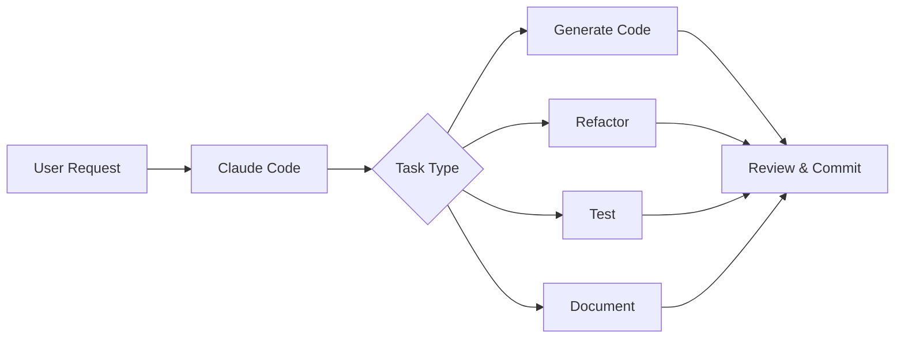

# Ultimate Claude Code to WPF Development Master Analysis

## Executive Summary

This document presents a comprehensive analysis and strategic plan for leveraging Claude Code AI assistant to create modern, maintainable WPF applications following industry best practices for 2025. The plan integrates cutting-edge development patterns, automation strategies, and AI-assisted workflows to maximize development efficiency and code quality.

## Table of Contents

1. [Current State Analysis](#current-state-analysis)
2. [Claude Code Capabilities for WPF](#claude-code-capabilities-for-wpf)
3. [Proposed Development Strategies](#proposed-development-strategies)
4. [Architecture Options](#architecture-options)
5. [Implementation Roadmap](#implementation-roadmap)
6. [Best Practices Integration](#best-practices-integration)
7. [Automation Opportunities](#automation-opportunities)
8. [Risk Mitigation](#risk-mitigation)
9. [Recommendations](#recommendations)

## Current State Analysis

### Environment Assessment
- **Platform**: Windows (win32)
- **Working Directory**: C:\priorEdrive\New Volume\WPFBase
- **Version Control**: Not initialized (Git repo setup recommended)
- **Claude Code Model**: Opus 4.1 (claude-opus-4-1-20250805)
- **Date**: 2025-09-04

### Key Findings
- Fresh project environment ready for WPF development
- No existing codebase constraints
- Opportunity to implement best practices from the start
- Claude Code running through terminal/CLI interface

## Claude Code Capabilities for WPF

### Core Strengths
1. **File Management**
   - Direct file editing and creation
   - Multi-file batch operations
   - Code refactoring across entire codebase

2. **Development Automation**
   - Git workflow management
   - Build and test automation
   - Lint and type checking
   - Documentation generation

3. **Code Generation**
   - MVVM boilerplate generation
   - Data binding code creation
   - Command pattern implementation
   - Dependency injection setup

4. **Analysis & Optimization**
   - Code review and security analysis
   - Performance bottleneck identification
   - SOLID principles enforcement
   - Pattern consistency checking

### Platform Considerations
- Windows development via WSL support
- Terminal-based workflow integration
- Visual Studio 2022 compatibility through GitHub Copilot
- MCP (Model Context Protocol) for enhanced context understanding

## Proposed Development Strategies

### Option 1: Lightweight MVVM with Community Toolkit
**Best for**: Small to medium applications, rapid prototyping, modern C# features

#### Structure
```
WPFBase/
├── src/
│   ├── App.xaml
│   ├── App.xaml.cs
│   ├── Models/
│   ├── ViewModels/
│   │   └── Base/
│   │       └── ObservableObject implementations
│   ├── Views/
│   ├── Services/
│   ├── Converters/
│   └── Resources/
├── tests/
│   ├── Unit/
│   └── Integration/
├── docs/
└── .claude/
    └── workflows/
```

#### Key Features
- Source generators for INotifyPropertyChanged
- Minimal boilerplate with attributes
- Modern async command support
- Lightweight dependency injection

#### Claude Code Automation Tasks
- Generate ViewModels with proper attribute decorations
- Create data binding snippets
- Implement command patterns automatically
- Generate unit test scaffolding

### Option 2: Enterprise-Ready with Prism Framework
**Best for**: Large-scale applications, modular architecture, complex navigation

#### Structure
```
WPFBase/
├── src/
│   ├── Shell/
│   │   ├── App.xaml
│   │   └── Bootstrapper.cs
│   ├── Modules/
│   │   ├── Module.Core/
│   │   ├── Module.Feature1/
│   │   └── Module.Feature2/
│   ├── Infrastructure/
│   │   ├── Interfaces/
│   │   └── Services/
│   ├── Common/
│   └── Resources/
├── tests/
│   ├── Unit/
│   ├── Integration/
│   └── UI/
├── build/
└── .claude/
    └── templates/
```

#### Key Features
- Modular application composition
- Region-based navigation
- Event aggregator for loose coupling
- Built-in dependency injection container
- Module catalog management

#### Claude Code Automation Tasks
- Generate module scaffolding
- Create region navigation code
- Implement event aggregation patterns
- Generate module catalog configurations

### Option 3: Hybrid Approach - Best of Both Worlds
**Best for**: Medium to large applications requiring flexibility

#### Structure
```
WPFBase/
├── src/
│   ├── App/
│   │   ├── App.xaml
│   │   └── Startup/
│   ├── Core/
│   │   ├── MVVM/ (Community Toolkit)
│   │   └── Navigation/ (Prism-inspired)
│   ├── Features/
│   │   ├── Feature.Home/
│   │   ├── Feature.Settings/
│   │   └── Feature.Data/
│   ├── Shared/
│   │   ├── Controls/
│   │   ├── Behaviors/
│   │   └── Extensions/
│   ├── Infrastructure/
│   └── Resources/
├── tests/
├── benchmarks/
└── .claude/
    ├── snippets/
    └── conventions.md
```

#### Key Features
- Community Toolkit for MVVM basics
- Custom navigation service
- Feature-based organization
- Selective Prism components
- Performance-optimized bindings

## Architecture Options

### 1. Clean Architecture Implementation
```
Domain Layer (Core Business Logic)
    ↓
Application Layer (Use Cases)
    ↓
Infrastructure Layer (Data Access, External Services)
    ↓
Presentation Layer (WPF Views and ViewModels)
```

**Claude Code Role**: 
- Generate layer boundaries
- Enforce dependency rules
- Create interface definitions
- Implement repository patterns

### 2. Vertical Slice Architecture
```
Feature/
├── Commands/
├── Queries/
├── Views/
├── ViewModels/
└── Services/
```

**Claude Code Role**:
- Generate feature scaffolding
- Ensure feature isolation
- Create cross-cutting concerns
- Implement mediator patterns

### 3. Traditional N-Tier
```
Presentation → Business Logic → Data Access
```

**Claude Code Role**:
- Generate DAL/BLL separation
- Create DTOs and mappings
- Implement service layers
- Generate validation logic

## Implementation Roadmap

### Phase 1: Foundation (Week 1-2)
1. **Project Setup**
   - Initialize Git repository
   - Configure .gitignore for WPF
   - Set up solution structure
   - Configure NuGet packages

2. **Core Infrastructure**
   - Implement chosen MVVM framework
   - Set up dependency injection
   - Create base classes and interfaces
   - Configure logging framework

3. **Development Standards**
   - Create CLAUDE.md with conventions
   - Set up EditorConfig
   - Configure code analyzers
   - Implement CI/CD pipeline basics

**Claude Code Tasks**:
```bash
# Initialize project
git init
dotnet new sln -n WPFBase
dotnet new wpf -n WPFBase.App
dotnet sln add WPFBase.App/WPFBase.App.csproj

# Add essential packages
dotnet add package CommunityToolkit.Mvvm
dotnet add package Microsoft.Extensions.DependencyInjection
dotnet add package Serilog
```

### Phase 2: Architecture Implementation (Week 3-4)
1. **MVVM Setup**
   - Create ViewModel base classes
   - Implement ICommand infrastructure
   - Set up data binding helpers
   - Create view locator service

2. **Navigation System**
   - Implement navigation service
   - Create view registry
   - Set up parameter passing
   - Implement back stack management

3. **Data Layer**
   - Design data models
   - Implement repositories
   - Set up data validation
   - Create data services

**Claude Code Automation**:
- Generate ViewModel templates
- Create navigation boilerplate
- Implement repository interfaces
- Generate validation attributes

### Phase 3: Feature Development (Week 5-8)
1. **Core Features**
   - User authentication
   - Main dashboard
   - Settings management
   - Data visualization

2. **Advanced Features**
   - Real-time updates
   - Background services
   - Plugin system
   - Theme management

**Claude Code Support**:
- Generate feature modules
- Create view/viewmodel pairs
- Implement business logic
- Generate unit tests

### Phase 4: Polish & Optimization (Week 9-10)
1. **Performance**
   - Implement virtualization
   - Optimize bindings
   - Add lazy loading
   - Profile and optimize

2. **Testing**
   - Unit test coverage
   - Integration tests
   - UI automation tests
   - Performance benchmarks

3. **Documentation**
   - API documentation
   - User guides
   - Developer documentation
   - Deployment guides

## Best Practices Integration

### MVVM Implementation Standards

#### 1. ViewModel Design
```csharp
// Claude Code Template
public partial class MainViewModel : ObservableObject
{
    [ObservableProperty]
    private string _title = "Main Window";
    
    [ObservableProperty]
    [NotifyPropertyChangedFor(nameof(CanExecute))]
    private bool _isLoading;
    
    [RelayCommand(CanExecute = nameof(CanExecute))]
    private async Task LoadDataAsync()
    {
        // Implementation
    }
    
    private bool CanExecute => !IsLoading;
}
```

#### 2. Data Binding Best Practices
- Use OneTime binding for static data
- Implement INotifyDataErrorInfo for validation
- Minimize binding complexity
- Use value converters appropriately

#### 3. Async Programming
```csharp
// Claude Code Pattern
public class DataService
{
    public async Task<IEnumerable<T>> GetDataAsync<T>()
    {
        try
        {
            return await Task.Run(() => LoadData<T>());
        }
        catch (Exception ex)
        {
            _logger.LogError(ex, "Failed to load data");
            throw;
        }
    }
}
```

### Code Quality Standards

#### 1. SOLID Principles
- **Single Responsibility**: One class, one purpose
- **Open/Closed**: Extension without modification
- **Liskov Substitution**: Interface compliance
- **Interface Segregation**: Focused interfaces
- **Dependency Inversion**: Abstraction over implementation

#### 2. Testing Strategy
```csharp
// Unit Test Template
[TestClass]
public class ViewModelTests
{
    [TestMethod]
    public async Task LoadCommand_WhenExecuted_LoadsData()
    {
        // Arrange
        var viewModel = new MainViewModel();
        
        // Act
        await viewModel.LoadCommand.ExecuteAsync(null);
        
        // Assert
        Assert.IsNotNull(viewModel.Data);
    }
}
```

#### 3. Performance Guidelines
- Virtualize large collections
- Use weak references for event handlers
- Implement disposal patterns
- Optimize XAML complexity

## Automation Opportunities

### 1. Code Generation Workflows

#### MVVM Boilerplate Generation
```yaml
# .claude/workflows/create-viewmodel.yaml
name: Create ViewModel
triggers:
  - command: "create-viewmodel"
steps:
  - generate: ViewModel class with ObservableObject
  - generate: Corresponding View XAML
  - generate: View code-behind with DataContext
  - generate: Unit test class
  - update: View locator registration
```

#### Service Implementation
```yaml
# .claude/workflows/create-service.yaml
name: Create Service
steps:
  - generate: Interface definition
  - generate: Service implementation
  - generate: Unit tests
  - update: DI container registration
  - generate: Mock for testing
```

### 2. Build and Deploy Automation

#### Continuous Integration
```yaml
# Claude Code CI Tasks
- Run: dotnet restore
- Run: dotnet build --configuration Release
- Run: dotnet test --no-build
- Run: dotnet publish --configuration Release
```

#### Release Automation
- Generate release notes from commits
- Update version numbers
- Create installer packages
- Deploy to distribution channels

### 3. Code Quality Automation

#### Pre-commit Hooks
```bash
# .claude/hooks/pre-commit
#!/bin/bash
# Format code
dotnet format

# Run analyzers
dotnet build /warnaserror

# Run tests
dotnet test --filter "Category=Fast"
```

#### Code Review Automation
- Check MVVM pattern compliance
- Verify naming conventions
- Ensure proper async/await usage
- Validate dependency injection

### 4. Documentation Generation

#### API Documentation
```csharp
/// <summary>
/// Claude Code will generate XML documentation
/// </summary>
public class DocumentedClass
{
    /// <summary>
    /// Method documentation
    /// </summary>
    /// <param name="input">Parameter description</param>
    /// <returns>Return value description</returns>
    public string Process(string input) => input;
}
```

## Risk Mitigation

### Technical Risks

#### 1. Performance Degradation
**Mitigation Strategies**:
- Implement performance benchmarks early
- Use profiling tools regularly
- Claude Code monitors for common pitfalls
- Automated performance regression tests

#### 2. Memory Leaks
**Prevention Measures**:
- Implement IDisposable properly
- Use weak event patterns
- Claude Code generates disposal code
- Memory profiling in CI pipeline

#### 3. Binding Errors
**Solutions**:
- Enable binding failure exceptions in debug
- Use strongly-typed bindings with x:Bind
- Claude Code validates XAML bindings
- Implement binding converters properly

### Process Risks

#### 1. Code Consistency
**Enforcement**:
- EditorConfig for formatting
- Roslyn analyzers for patterns
- Claude Code enforces conventions
- Regular code reviews

#### 2. Technical Debt
**Management**:
- Regular refactoring sprints
- Technical debt tracking
- Claude Code identifies code smells
- Automated complexity metrics

## Recommendations

### Immediate Actions (Priority 1)

1. **Initialize Git Repository**
   ```bash
   git init
   git add .gitignore
   git commit -m "Initial commit"
   ```

2. **Choose Architecture Approach**
   - Recommended: Start with Option 3 (Hybrid Approach)
   - Provides flexibility and scalability
   - Best balance of simplicity and power

3. **Set Up Development Environment**
   ```bash
   # Install .NET SDK
   # Install Visual Studio 2022 or VS Code
   # Configure Claude Code workflows
   ```

4. **Create Initial Project Structure**
   ```bash
   dotnet new sln -n WPFBase
   dotnet new wpf -n WPFBase.App -f net8.0-windows
   dotnet new classlib -n WPFBase.Core -f net8.0
   dotnet new xunit -n WPFBase.Tests -f net8.0
   ```

### Short-term Goals (Week 1-2)

1. **Implement MVVM Foundation**
   - Install CommunityToolkit.Mvvm
   - Create base ViewModels
   - Set up data binding infrastructure

2. **Configure Development Standards**
   - Create CLAUDE.md file
   - Set up code analyzers
   - Configure build pipeline

3. **Create First Feature**
   - Implement main window
   - Add navigation structure
   - Create settings view

### Long-term Strategy (Month 1-3)

1. **Feature Development**
   - Implement core business features
   - Add data persistence layer
   - Create user management

2. **Quality Assurance**
   - Achieve 80% test coverage
   - Implement integration tests
   - Set up UI automation

3. **Deployment Preparation**
   - Create installer
   - Implement auto-update mechanism
   - Prepare documentation

## Claude Code Integration Points

### 1. Development Workflow


### 2. Automation Triggers
- **On File Save**: Format and lint
- **Pre-Commit**: Run tests and checks
- **Post-Merge**: Update dependencies
- **On PR**: Generate documentation

### 3. Custom Commands
```bash
# .claude/commands/
claude create-feature [name]     # Scaffold new feature
claude generate-tests [class]    # Generate unit tests
claude analyze-performance       # Run performance analysis
claude update-docs               # Update documentation
```

## Success Metrics

### Development Efficiency
- **Code Generation**: 60% reduction in boilerplate writing
- **Bug Detection**: 40% fewer runtime errors
- **Review Time**: 50% faster code reviews
- **Documentation**: 100% API coverage

### Code Quality
- **Test Coverage**: Minimum 80%
- **Code Complexity**: Cyclomatic complexity < 10
- **Technical Debt**: Debt ratio < 5%
- **Performance**: UI response < 100ms

### Project Milestones
- **Week 2**: Foundation complete
- **Week 4**: First feature deployed
- **Week 8**: Core features complete
- **Week 10**: Production ready

## Conclusion

This comprehensive plan provides multiple pathways for creating a robust WPF application using Claude Code's capabilities. The recommended approach combines modern MVVM patterns with AI-assisted development to maximize productivity while maintaining code quality.

### Key Takeaways
1. **Start Simple**: Begin with the hybrid approach for flexibility
2. **Automate Early**: Set up Claude Code workflows from day one
3. **Test Continuously**: Integrate testing into every step
4. **Document Always**: Use Claude Code for automatic documentation
5. **Iterate Frequently**: Regular refactoring with AI assistance

### Next Steps
1. Review and select preferred architecture option
2. Initialize project with chosen structure
3. Configure Claude Code workflows
4. Begin implementation of Phase 1

---

**Document Version**: 1.0.0
**Last Updated**: 2025-09-04
**Author**: Claude Code Analysis System
**Status**: Ready for Implementation